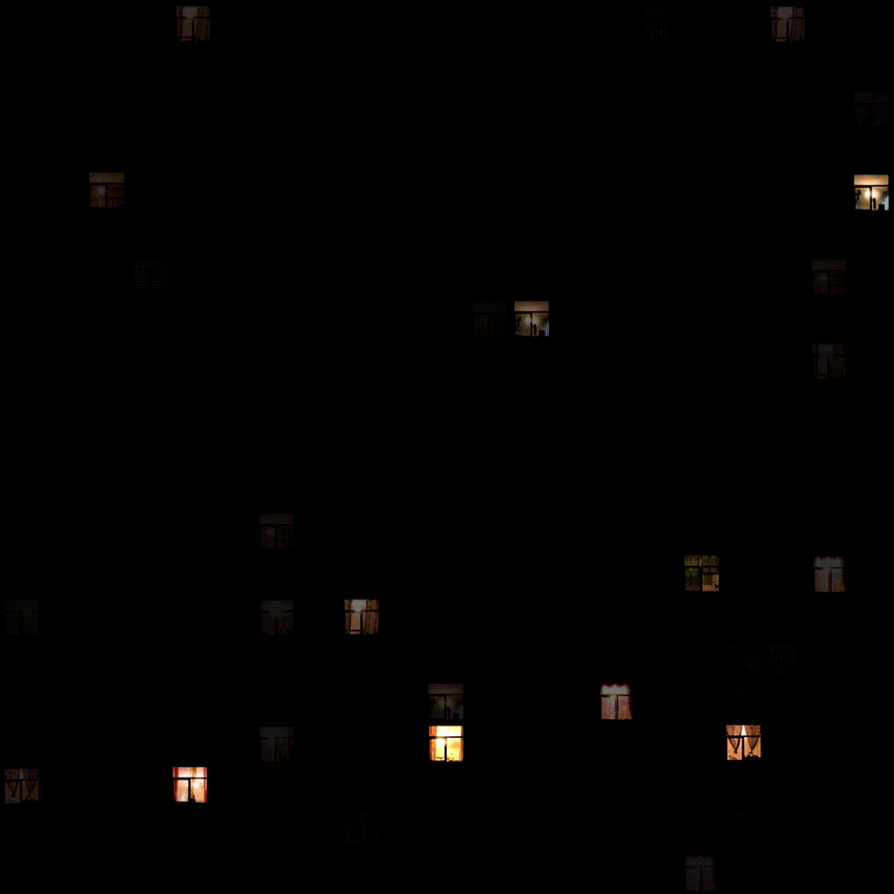
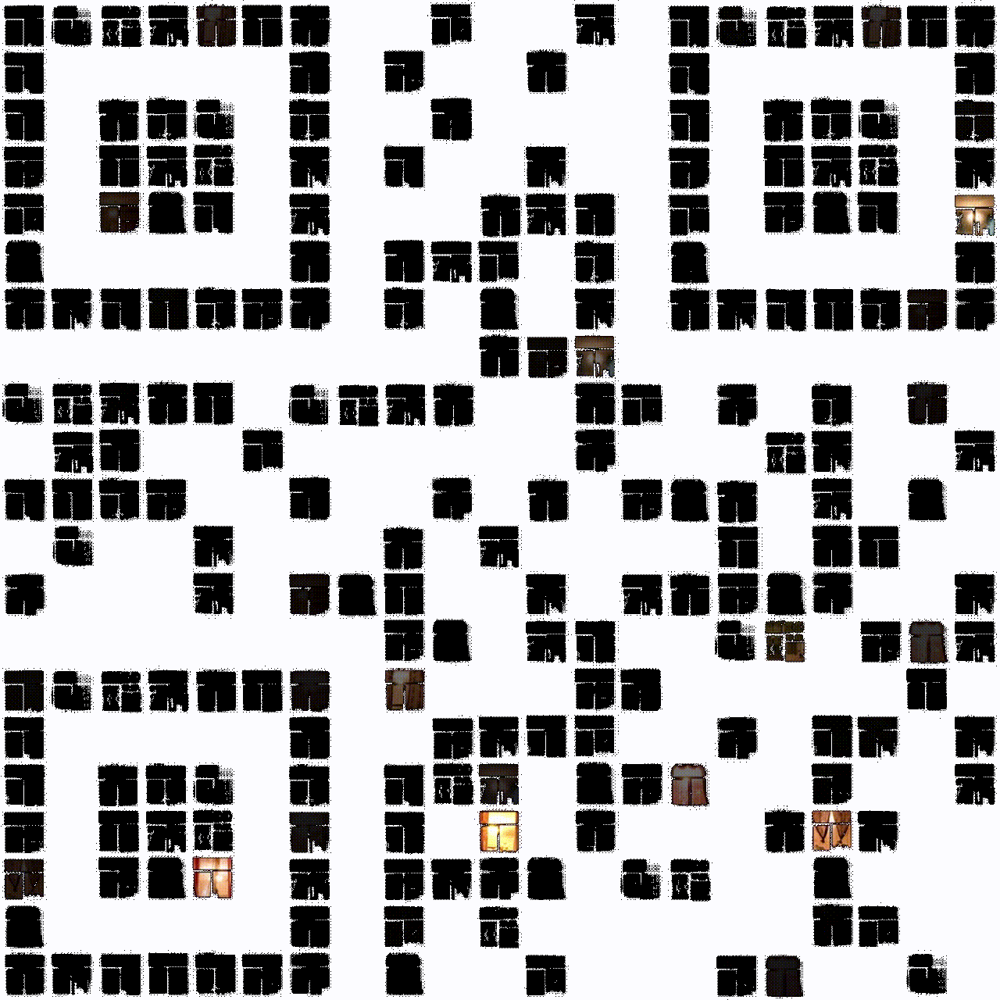

# Windows

## The Given
Append what you find to "ASIS\_" and send that as flag.

An [mp4 video](windows_assets/windows.mp4) is attached. It's a video of small
pictures of windows flashing across the screen with a strange soundtrack.

## Analysis
Let's start with the audio. Pull out the audio with ffmpeg.

    ffmpeg -i windows.mp4 windows.wav

The audio sounds like it's something in reverse, and opening it up in Audacity
and reversing it confirms this. It's a man's voice saying
`51324984652187698521487459648201`. This is 32 characters, so it could be an
md5 hash, but appending that to `ASIS_` isn't correct flag, so we're not done
yet.

Now we look at the video. If you stare at it for awhile, it looks like the
windows flashing on the screen are tracing out some sort of pattern, but it's
really hard to tell. Additionally, there seem to be a fixed set of positions in
which the windows appear.

In order to get a better look at it, we can turn the video into a GIF so we
can scroll a frame at a time in GIMP.

    ffmpeg -i windows.mp4 windows.gif

Only the first frame of the generated GIF has the black background, so we
delete that with the color picker tool, and we can see that it was indeed a
pattern.

It's a QR code (we've seen enough of those before in other CTFs, turns out this one was
a Version 1 QR code, which is 21x21). The QR scanner apps on our phones
couldn't quite read it, so we had to fudge it into a more readable state in
GIMP with creative selections and scaling (in particular, I selected all of
the white with the color picker tool, inverted the selection, grew the
selection by 5 pixels, then shrank it by 3, then flood filled black, then
scaled it down to 21x21 without interpolation).

.

The QR code encodes the message "xorwith313". So we xor the above number
with 313

    51324984652187698521487459648201 ^ 313 = 51324984652187698521487459648496

The flag is `ASIS_51324984652187698521487459648496`.
